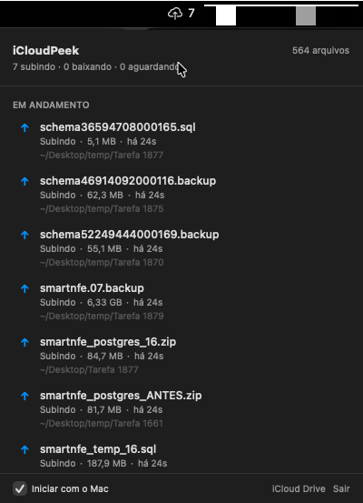

# iCloudPeek

> **Saiba em tempo real o que o iCloud Drive está subindo ou baixando — sem abrir Finder, sem terminal, sem adivinhação.**

Um app macOS de barra de menu que lista todos os arquivos em trânsito com o iCloud, em tempo real. Feito para quem precisa saber *por que* o Mac ainda está sincronizando depois de horas.

<p align="center">
  
</p>

## Por que existe

O macOS esconde quase tudo sobre o iCloud Drive. O Finder mostra uma nuvenzinha do lado do arquivo — e só. Se você copia 6 GB de backups pra dentro do iCloud e quer saber "quanto falta?", "esse arquivo travou?", "por que a ventoinha não para?" — não tem resposta.

O iCloudPeek resolve isso. Um ícone na barra de menu, um clique, e você vê:

- Todos os arquivos subindo neste momento
- Todos os arquivos baixando neste momento
- Tamanho de cada um
- Há quanto tempo cada transferência começou
- Em que pasta o arquivo mora
- Clique duplo abre o arquivo no Finder

## Features

- 🔄 **Atualização ao vivo** — lista se atualiza enquanto você olha (janela SwiftUI com timer)
- ☁️ **Ícone dinâmico na barra** — nuvem com seta ↑ pra upload, ↓ pra download, ☁️ parado quando tudo está sincronizado
- 🔢 **Contador no ícone** — mostra o total de arquivos em trânsito sem precisar abrir a janela
- 📂 **Três fontes** — lê `~/Library/Mobile Documents/`, `~/Desktop` e `~/Documents` (funciona com Desktop & Documents Sync ligado)
- 🔔 **Notificação ao zerar a fila** — aviso quando todas as transferências terminam
- 🚀 **Launch at login** — opcional, ativado por um checkbox no app
- 🪶 **Leve** — escaneia o iCloud a cada 3 s, usa pouca CPU

## O que não dá pra fazer (honestidade)

**% de progresso e bytes transferidos não são expostos pelo macOS público.** A API `NSMetadataQuery` com os atributos de porcentagem só funciona com *entitlement* de iCloud, que exige conta Apple Developer paga ($99/ano). O `brctl` da Apple também não mostra bytes em voo. O Finder acessa essa informação por API privada.

O iCloudPeek mostra o que é acessível: **tamanho do arquivo + tempo desde a detecção do upload/download**. Na prática isso é o que você quer saber — *"faz 1h que esse arquivo de 6 GB está subindo, algo travou"* — mesmo sem a barrinha de %.

## Stack

- Swift 5.9+
- SwiftUI + AppKit (`NSStatusItem` + `NSPanel` customizado)
- `URL.resourceValues` com `URLResourceKey.ubiquitousItem*` para detectar estado de cada arquivo
- macOS 14 (Sonoma) ou superior — testado em macOS 26.4 (Tahoe) com Apple Silicon M4 Max

## Instalação

Requisitos: **Xcode** (App Store) + **Homebrew**.

```bash
# 1. Clone o repo
git clone https://github.com/fredwilliamtjr/iCloudPeek.git
cd iCloudPeek

# 2. Instale o XcodeGen (gerador de projeto)
brew install xcodegen

# 3. Gere o .xcodeproj
xcodegen generate

# 4. Compile e instale em /Applications
xcodebuild -project iCloudPeek.xcodeproj -scheme iCloudPeek -configuration Release build \
  CODE_SIGN_IDENTITY="-" CODE_SIGNING_REQUIRED=NO CODE_SIGNING_ALLOWED=NO

cp -R ~/Library/Developer/Xcode/DerivedData/iCloudPeek-*/Build/Products/Release/iCloudPeek.app /Applications/
open /Applications/iCloudPeek.app
```

Na primeira vez, o macOS pode reclamar que o app é de "desenvolvedor não identificado" (porque está assinado apenas localmente). Solução: botão direito no app em `/Applications/` → **Abrir** → confirmar. Depois disso nunca mais pergunta.

## Estrutura do código

```
iCloudPeek/
├── App/
│   ├── iCloudPeekApp.swift      # @main + NSApplicationDelegateAdaptor
│   └── AppDelegate.swift        # liga SyncStore + SyncMonitor + MenuBarController
├── Core/
│   ├── SyncMonitor.swift        # escaneia múltiplas raízes a cada 3s, lê ubiquity attrs
│   ├── SyncItem.swift           # model por arquivo
│   └── SyncStore.swift          # ObservableObject singleton, publica estado
├── UI/
│   ├── MenuBarController.swift  # NSStatusItem + NSPanel borderless
│   └── LivePopoverView.swift    # janela SwiftUI com timer de 1s pra refresh visual
├── Utilities/
│   ├── LaunchAtLogin.swift      # SMAppService
│   └── Notifications.swift      # UNUserNotificationCenter
├── Resources/
│   └── Assets.xcassets          # AppIcon + AccentColor
├── Info.plist                   # LSUIElement = true (app só na barra)
└── iCloudPeek.entitlements      # sandbox off (precisa ler ~/Library/Mobile Documents/)
```

## Pegadinhas técnicas aprendidas

Guardadas aqui porque custaram tempo pra descobrir:

### 1. `NSPopover` + SwiftUI crasha no macOS 26 + Apple Silicon

Qualquer `NSPopover` com conteúdo SwiftUI dispara um bug no driver Metal (`-[__NSCFNumber length]: unrecognized selector` em `createContextTelemetryDataWithQueueLabelAndCallstack`). Não importa se você remove `.ultraThinMaterial`, desliga animação, ou seta env vars Metal — continua crashando.

**Solução:** usar `NSPanel` borderless em vez de `NSPopover`. Mesma UX de popover, driver diferente, sem crash. É o padrão que apps tipo iStat Menus usam.

### 2. Desktop & Documents Sync do iCloud usa symlinks

Se o usuário tem a opção "Desktop e Documents no iCloud" ligada, a pasta `~/Library/Mobile Documents/com~apple~CloudDocs/Desktop` é um **symlink** pra `~/Desktop`. `FileManager.enumerator` **não segue symlinks** por padrão, então escanear só `~/Library/Mobile Documents/` perde tudo que está no Desktop do usuário — que geralmente é onde estão os arquivos ativos.

**Solução:** escanear múltiplas raízes (`~/Library/Mobile Documents`, `~/Desktop`, `~/Documents`), deduplicar por `canonicalPath`, e filtrar com `isUbiquitousItemKey == true` pra pegar só o que é iCloud.

### 3. `NSMetadataItem(url:)` não retorna atributos de ubiquity

A documentação da Apple diz que `NSMetadataItem.values(forAttributes:)` funciona pra arquivos isolados. Na prática, os atributos de ubiquity (`NSMetadataUbiquitousItemIsUploadingKey` etc.) **só populam dentro de uma `NSMetadataQuery` ativa**.

**Solução:** usar `URL.resourceValues(forKeys: [.ubiquitousItemIsUploadingKey, ...])` em vez. Funciona, retorna flags booleanas e erros. Só não expõe porcentagem.

### 4. App "iCloud" no nome = rejeição na Mac App Store

Apple reserva o prefixo "iCloud" no nome do app. Distribuição via MAS é impossível. A saída é Developer ID + notarização pra distribuir fora.

## Roadmap

- [x] Monitor em tempo real com estado por arquivo
- [x] Janela SwiftUI ao vivo sem crash do Metal
- [x] Ícone na barra trocando conforme atividade
- [x] Suporte a Desktop & Documents Sync
- [x] Launch at login · notificação ao zerar fila
- [x] Ícone de app customizado
- [ ] Developer ID + notarização (pra distribuir sem aviso)
- [ ] Tempo estimado baseado em velocidade de rede
- [ ] Histórico persistente entre launches (hoje é só por sessão)
- [ ] Atalho de teclado pra abrir a janela
- [ ] Preferências em janela dedicada

## Licença

MIT. Usa, forka, manda PR.

## Créditos

Feito com [Claude Code](https://claude.com/claude-code) — quase todo o código escrito em conversa com o modelo, debuggado em conjunto. O app é um bom exemplo do que dá pra fazer em 1 sessão de vibe coding com um bom par de pair-programming.
