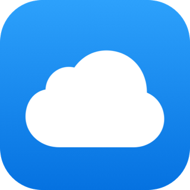
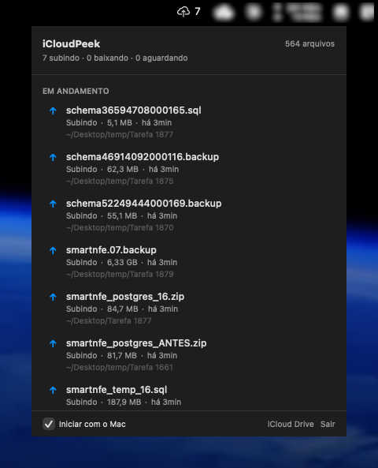
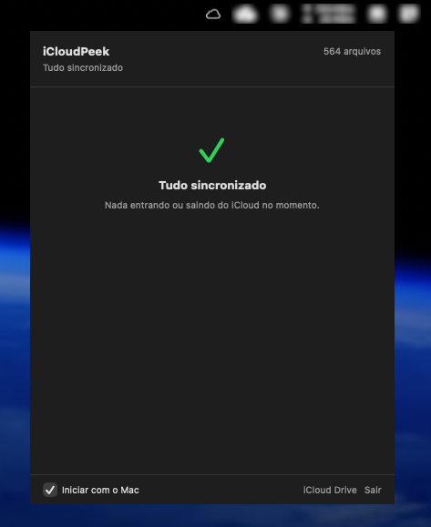

<div align="center">
  

  <h1>iCloudPeek</h1>

  <p><strong>Saiba em tempo real o que o iCloud Drive está subindo ou baixando.</strong></p>
  <p>Sem abrir Finder, sem terminal, sem ficar adivinhando por que a ventoinha não para.</p>

  <p>
    
    
    
    
  </p>
</div>

---

<table align="center">
  <tr>
    <td align="center"></td>
    <td align="center"></td>
  </tr>
  <tr>
    <td align="center"><sub><b>Trabalhando</b> — 7 arquivos subindo</sub></td>
    <td align="center"><sub><b>Em espera</b> — tudo sincronizado</sub></td>
  </tr>
</table>

## 🧭 O problema

O macOS esconde quase tudo sobre o iCloud Drive. O Finder mostra uma nuvenzinha do lado do arquivo — e só. Se você copia 6 GB de backups pra dentro do iCloud e quer saber *"quanto falta?"*, *"esse arquivo travou?"*, *"por que a ventoinha não para?"* — não tem resposta nativa. Resta abrir Terminal, rodar `brctl status`, tentar entender um log técnico que nem foi feito pra humano ler.

## ✨ A solução

iCloudPeek é um app de barra de menu que **lista em tempo real cada arquivo em trânsito** no seu iCloud Drive — inclusive os que vivem em `~/Desktop` e `~/Documents` quando você tem Desktop & Documents Sync ligado. Um ícone na barra, um clique, e você vê: quem está subindo, quem está baixando, tamanho de cada um, há quanto tempo a transferência começou, em que pasta mora. Clique num arquivo pra revelar no Finder.

## 🎯 Features

- ☁️ **Ícone dinâmico na barra** — nuvem com seta ↑ subindo, ↓ baixando, ☁️ parada quando tudo está sincronizado
- 🔢 **Contador no ícone** — total de arquivos em trânsito visível sem abrir nada
- 🪟 **Janela ao vivo** — lista se atualiza enquanto você olha (`NSPanel` SwiftUI com timer de 1s)
- 📂 **Três fontes de varredura** — escaneia `~/Library/Mobile Documents/`, `~/Desktop` e `~/Documents`
- 🔔 **Notificação** quando a fila de sincronização zera
- 🚀 **Iniciar com o Mac** via `SMAppService` (toggle nativo)
- 🖱️ **Clique pra revelar** — abre o arquivo no Finder na localização dele
- 🪶 **Discreto** — só na barra de menu, sem ícone no Dock

## 📦 Instalação

1. Baixe o `.dmg` da página de [Releases](https://github.com/fredwilliamtjr/iCloudPeek/releases)
2. Monte o DMG e arraste o `iCloudPeek.app` pra pasta **Applications**
3. Primeira abertura: clique com **botão direito → Abrir** (o Gatekeeper reclama porque o app não é assinado com Developer ID)
4. Se o macOS insistir que "o app está danificado":
   ```bash
   xattr -dr com.apple.quarantine /Applications/iCloudPeek.app
   ```

## ⚙️ Como usar

Não tem configuração. Abre e usa:

1. Clique no ícone da nuvem na barra de menu
2. A janela lista os arquivos em trânsito com nome, tamanho, pasta e tempo desde detectado
3. Clique em qualquer arquivo da lista pra revelar no Finder
4. No rodapé: toggle **Iniciar com o Mac**, atalho pra abrir o **iCloud Drive** e **Sair**

O ícone na barra troca sozinho conforme a atividade. O número ao lado (`7`, `12`, etc.) é o total de arquivos em trânsito agora.

## 🧱 Arquitetura

```
iCloudPeek/
├── App/                  # @main + AppDelegate (agent policy, start do monitor)
├── Core/                 # Modelo, store e scanner
├── UI/                   # NSStatusItem + NSPanel SwiftUI
├── Utilities/            # Launch at login + notificações
└── Resources/            # Assets (ícone + accent color)
```

| Componente | Responsabilidade |
|---|---|
| `SyncMonitor` | Timer de 3 s — enumera múltiplas raízes do iCloud, dedupe por `canonicalPath`, rastreia `firstSeen` por arquivo |
| `SyncStore` | `ObservableObject` singleton publicando `active` / `pending` / `recentlyFinished` e callback `onQueueEmptied` |
| `SyncItem` | Model imutável com estado (`uploading` / `downloading` / `pending` / `error`), tamanho, pasta, timestamp |
| `MenuBarController` | `NSStatusItem` + `NSPanel` borderless hospedando uma view SwiftUI via `NSHostingController` |
| `LivePopoverView` | Raiz SwiftUI da janela com `Timer.publish(every: 1)` pra atualizar o "há Xmin" em tempo real |
| `LaunchAtLogin` | Wrapper sobre `SMAppService.mainApp` |
| `Notifications` | `UNUserNotificationCenter` pro toast de "fila zerada" |

## 🚫 Limitação conhecida

**A Apple não expõe `%` de upload/download nem bytes transferidos fora do Finder.** Testado exaustivamente: `NSMetadataQuery` com scopes ubiquitous retorna `resultCount = 0` sem iCloud entitlement pago ($99/ano + CloudKit configurado). O `brctl` mostra apenas o tamanho total e status de tentativa (`active`, `attempts`, `last`, `next`). Upload no iCloud não aumenta o arquivo local, então delta-de-tamanho também não funciona pra estimar progresso.

O iCloudPeek mostra o que é realmente acessível: **tamanho do arquivo + tempo desde a detecção** (*"subindo há 12min"*). Na prática é o que você quer saber — *"faz 1h que esse arquivo de 6 GB está subindo, algo travou."*

## 🔨 Build a partir do código

Requisitos:
- macOS 14.0+
- Xcode 15+
- Swift 5.9
- [`xcodegen`](https://github.com/yonaskolb/XcodeGen) (`brew install xcodegen`)

```bash
git clone https://github.com/fredwilliamtjr/iCloudPeek.git
cd iCloudPeek
xcodegen generate
open iCloudPeek.xcodeproj
```

Ou via linha de comando:

```bash
xcodebuild -project iCloudPeek.xcodeproj -scheme iCloudPeek -configuration Release \
    CODE_SIGN_IDENTITY="-" CODE_SIGNING_REQUIRED=NO CODE_SIGNING_ALLOWED=NO build
```

### Gerar um DMG distribuível

```bash
brew install create-dmg            # dependência
./scripts/create-dmg.sh 0.1.0      # monta dist/iCloudPeek-0.1.0.dmg
```

### Regerar o ícone do app

```bash
swift scripts/generate-icon.swift iCloudPeek/Resources/Assets.xcassets/AppIcon.appiconset/
```

## 🔒 Segurança / sandboxing

- **App Sandbox**: desligado. Necessário pra ler `~/Library/Mobile Documents/` fora do container do app.
- **Entitlements**: apenas `com.apple.security.files.user-selected.read-only` e `com.apple.security.network.client`.
- **Acesso a arquivos**: só leitura via `URL.resourceValues` e enumeração de diretório. O app **nunca** escreve ou modifica nada no iCloud.
- **Assinatura**: ad-hoc por padrão. Pra distribuição sem fricção de Gatekeeper, precisaria de Developer ID + notarização da Apple.

## 💡 Pegadinhas aprendidas

Guardadas aqui porque custaram tempo real:

1. **`NSPopover` + SwiftUI crasha no macOS 26 + Apple Silicon** — bug no driver Metal em `createContextTelemetryDataWithQueueLabelAndCallstack`. `MenuBarExtra(...).menuBarExtraStyle(.window)` também usa `NSPopover` por trás e também crasha. **Solução:** trocar por `NSPanel` borderless com `NSHostingController`. Mesma UX, driver diferente, sem crash.
2. **Desktop & Documents Sync usa symlinks** — a pasta `com~apple~CloudDocs/Desktop` é um `symlink` pra `~/Desktop`. `FileManager.enumerator` não segue symlinks. **Solução:** escanear múltiplas raízes e deduplicar por `canonicalPath`.
3. **`NSMetadataItem(url:)` não retorna os ubiquity attrs** — só populam dentro de uma `NSMetadataQuery` ativa. **Solução:** `URL.resourceValues(forKeys: [.ubiquitousItemIsUploadingKey, ...])`.
4. **App com "iCloud" no nome** é rejeitado na Mac App Store. Distribuição tem que ser via Developer ID + notarização direto.

## 🗺️ Roadmap

- [x] Monitor em tempo real com estado por arquivo
- [x] Janela SwiftUI ao vivo (sem crash do Metal)
- [x] Ícone na barra trocando conforme atividade
- [x] Suporte a Desktop & Documents Sync
- [x] Launch at login + notificação de fila vazia
- [x] DMG distribuível + GitHub Release
- [ ] Developer ID + notarização (distribuir sem aviso do Gatekeeper)
- [ ] Tempo estimado baseado em velocidade média de rede
- [ ] Histórico persistente entre launches
- [ ] Atalho de teclado pra abrir a janela
- [ ] Preferências em janela dedicada
- [ ] Localização em inglês

## 📄 Licença

TBD

---

<div align="center">
  <sub>Feito com ☕ por <a href="https://github.com/fredwilliamtjr">@fredwilliamtjr</a></sub>
</div>
